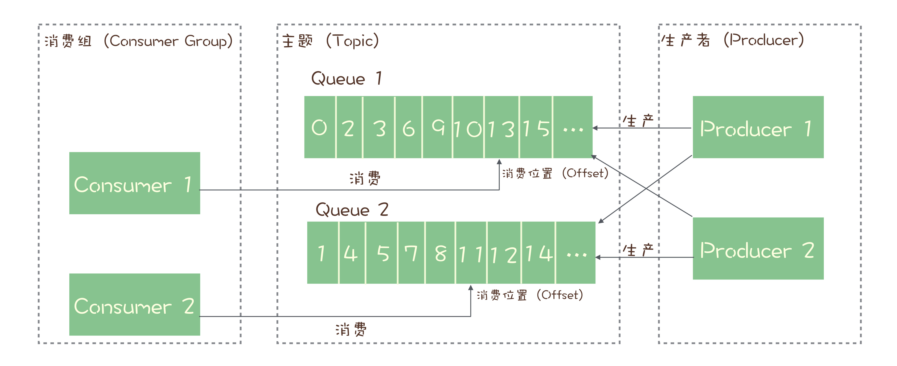

## 消息队列解决了什么问题？

- 消息队列最主要解决了系统间 **数据通信** 的问题

## 消息队列的使用场景

- 异步处理
  - 把不重要的同步串行，改成异步，可以更快地返回结果
  - 减少等待，自然实现了步骤之间的并发，提升系统的性能
- 流量控制
  - 将网关将请求放入请求队列进入等待状态，后端去处理请求队列的参数，然后网关再响应 ，一旦超时就丢弃响应服务错误给请求，来限制流量
    - 大致的思路是，网关会把用户的request缓存起来，然后发消息，至于发的消息内容不一定就是这个原封不动的request对象，只要把Request中必要的信息发给后端就可以了。后端服务可以用`RPC`通知网关秒杀结果，网关收到结果后找到对应的Request来构建Response返回即可。
  - 使用令牌桶
    - 控制流量的原理是：单位时间内只发放固定数量的令牌到令牌桶中，规定服务在处理请求之前必须先从令牌桶中拿出一个令牌，如果令牌桶中没有令牌，则拒绝请求，这样就保证单位时间内，能处理的请求不超过发放令牌的数量，起到了流量控制的作用
- 服务解耦
  - 订单服务在订单变化时发送一条消息到消息队列的一个主题 Order 中， 多有下游系统都订阅主题 Order 这样每个下游系统都可以获得一份实时完整的订单系统，而不必在创建订单的时候一个个系统进行

## 常见的消息队列选型
  - 选型的基本标准
    - 开源
    - 流行，热门，兼容性好
    - 消息的可靠传递： 不丢消息
    - Cluster: 支持集群
    - 性能：具备足够好的性能

## 可供选择的消息队列产品

- **`RabbitMQ`**
  - 优势
    - 轻量级
    - 灵活的路由配置
    - 兼容性好
  - 问题
    - 对消息堆积的支持并不好，设计理念为消息队列是一个管道，大量的消息挤压是一种不正常的情况
    - 性能一般，每秒钟可以处理几万到十几万条消息
    - 使用Erlang 二次开发的可维护性
- **`RocketMQ`**
  - 优势
    - 响应时延做了优化，金融级别的稳定性
    - 国人开发中文社区活跃，每秒钟可以处理几十万条消息
  - 问题
    - 国际上没那么流行，与周边生态系统的集成跟兼容要略逊一筹
- **`Kafka`**
  - 优势
    - 设计目的是为了处理海量日志，早期版本存在一定问题
    - Kafka与周边生态系统的兼容性时最好的，特别是大数据和流计算领域，几乎所有的相关开源系统都会优先支持 Kafka
    - 异步收发性能是最好的，每秒也是 几十万条消息
  - 问题
    - 对于消息数量达不到一定量时，`Kafka`的时延反而比较高，所以`kafka`不太适合在线业务场景
- **`ActiveMQ`**
  - 已经进入老年期，性能无法跟现代消息队列做比较，存在的目的是为了兼容老一辈的产品
- **`ZeroMQ`** 
  - 不是一个纯粹的消息队列，而是一个基于消息队列的多线程网络库
- 总结
  - 一般场景 开箱即用可以考虑**`RabbitMQ`**
  - 在线业务，如交易系统可以考虑 **`RocketMQ`** 
  - 海量数据处理，收集日志，监控信息，前端埋点，大数据，流计算，Kafka比较适合

## 消息模型

- 主题与队列的区别
  - 队列 是一种先进先出的线性表，通常使用链表或者数组来实现，队列只允许在后端进行插入，在前端进行删除操作，是严格有序的。
    - 早期的消息队列，就是严格按照队列数据结构来设计，队列模式
      - 消费者（consumer）《---- 队列《---- 生产者（producer）
      - 特点
        - 如果有多个消费者，消费者之间是竞争的关系，每个消费者只能接受到队列中的一部分消息
      - 不足之处
        - 如果需要把一份消息数据分配给多个消费者，要求每个消费者都能收到全量的消息，就很难做到了
    - 另一种消息队列 发布-订阅模型（Publish-Subscribe Pattern）
      - 发布者 Publisher
        - 发送-------》主题Topic
      - 订阅者 Subscribe
        - 订阅主题 
        - 从主题中 接受 -----》消息 
    - 两者最大的区别就是，一份消息数据能不能被消费多次的问题
    - `RabbitMQ` 的消息模型
      - 现代的消息队列产品使用的消息模型大多是这种发布-订阅模型，但是 `RabbitMQ` 坚持使用 队列模型
      - `RabbitMQ` 解决发布订阅问题的方案是 处于生产者与队列之间的Exchange 模块
        - 生产者 Producer
        - Exchange
          - 队列1 ---》消费者
          - 队列2 ---》消费者 
        - 
      - 由Exchange将消息发送到多个队列，这样就变相实现了发布订阅模型
    - `RocketMQ` 的消息模型
      - 中规中矩的`RocketMQ` 属于发布-订阅模型
      - 
      - 消息队列的请求确认机制
        - 生产者向主题中投放 消息时 一定要主题响应成功，它才会确认已经存入，不然会再次投放
        - 消费者在收到消息完成业务逻辑后也会向消息队列端响应消费成功的信息，不然就会一直给消费者发送消息
        - 也就是说每个主题任意时刻，只会有一个消费者实例来消费，效率太低

## **`RabbitMQ`**
- RabbitMQ安装教程 https://segmentfault.com/a/1190000018916099 
- 基础使用教程（一 ~ 五）
  - https://segmentfault.com/a/1190000011825148
  - https://segmentfault.com/a/1190000011829380
- 点对点模式  一个生产者者一个消费者模式
  - 生产者生成数据送往 管道
  - 消费者监听管道消费数据
  - 模式的特点在于实时性，你发了我马上就能知道，并能处理
  - 模式的缺点在于易堆积，一个消费者一次只能处理一条消息，要是处理时间比较长，就会消息堆积，影响正常业务
- 一个生产者多个消费者模式	
  - 一个生产者生成数据送往管道
  - 多个消费者监听管道消费数据
  - 模式的特点在于实时性，你发了我马上就能知道，多开几个消费者总能及时的去处理数据
  - 模式的缺点在于资源浪费，你要按照最大峰值去配置消费者的数量
- 消息确认机制
  - 我发你了----》我收到了OK 结束 
  - 我发你了----》我觉得有问题  循环到 出现我收到了为止
